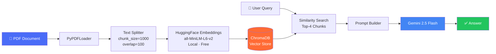
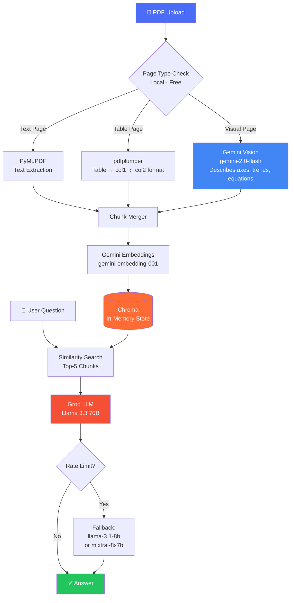
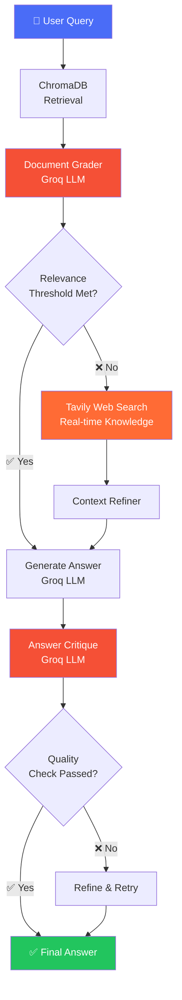
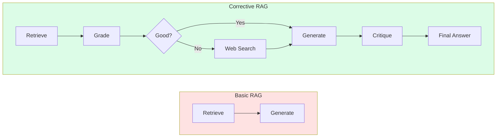
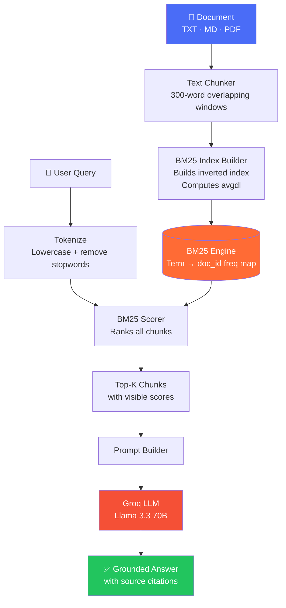
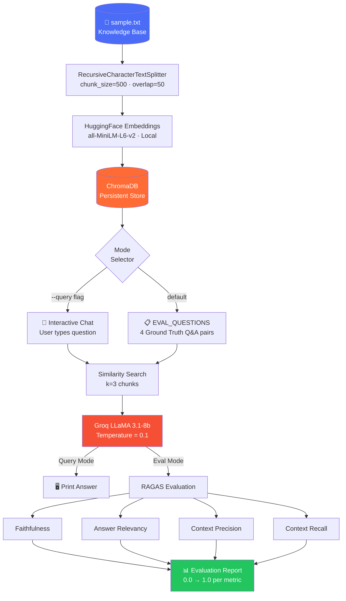
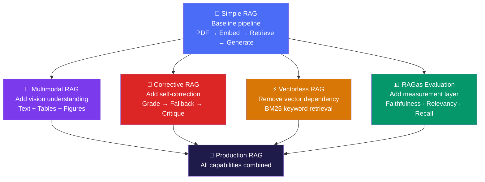

<div align="center">

# 🔐 RAG-Vault

### A curated collection of production-grade Retrieval-Augmented Generation implementations

[](https://python.org)
[](https://langchain.com)
[](https://groq.com)
[](https://aistudio.google.com)
[](https://trychroma.com)
[](LICENSE)

*Five distinct RAG architectures — from zero-vector retrieval to multimodal understanding — each solving a different real-world retrieval challenge.*

</div>

---

## 📌 Table of Contents

- [Overview](#-overview)
- [Architecture Comparison](#-architecture-comparison)
- [Project Index](#-project-index)
  - [Simple RAG](#1--simple-rag)
  - [Multimodal RAG](#2--multimodal-rag--paperchat)
  - [Corrective RAG](#3--corrective-rag-crag)
  - [Vectorless RAG](#4--vectorless-rag)
  - [RAGas Evaluation](#5--ragas-evaluation-framework)
- [Tech Stack](#-tech-stack)
- [RAG Evolution Map](#-rag-evolution-map)
- [Author](#-author)

---

## 🔍 Overview

**RAG-Vault** is a systematic exploration of Retrieval-Augmented Generation (RAG) paradigms. Each project in this vault tackles a different retrieval problem — from the foundational pipeline to self-correcting, vectorless, and multimodal variants — along with a full evaluation framework using industry-standard RAGAS metrics.

This repository serves as both a **reference library** and a **portfolio of applied LLM engineering**.

```
RAG-Vault/
├── simple-rag/          # Baseline: PDF + ChromaDB + Gemini
├── multimodal-rag/      # Vision-aware: Tables, figures, equations
├── corrective-rag/      # Self-correcting: Grading + web fallback
├── vectorless-rag/      # BM25: No embeddings, no vector DB
└── rag-as/              # Evaluation: RAGAS metrics pipeline
```

---

## 📊 Architecture Comparison

| Feature | Simple RAG | Multimodal RAG | Corrective RAG | Vectorless RAG | RAGas |
|---|---|---|---|---|---|
| **Retrieval Method** | Vector (ChromaDB) | Vector (Chroma) | Vector + Web | BM25 (keyword) | Vector (ChromaDB) |
| **Embeddings** | HuggingFace (local) | Gemini API | Google API | ❌ None | HuggingFace (local) |
| **LLM** | Gemini 2.5 Flash | Groq (Llama 3.3) | Groq (Llama 3) | Groq (Llama 3.3) | Groq (LLaMA 3.1) |
| **Vision/Multimodal** | ❌ | ✅ Gemini Vision | ❌ | ❌ | ❌ |
| **Self-Correction** | ❌ | ❌ | ✅ Grade + Critique | ❌ | ❌ |
| **Web Fallback** | ❌ | ❌ | ✅ Tavily Search | ❌ | ❌ |
| **UI** | CLI | Streamlit | CLI | Streamlit | CLI |
| **Evaluation** | ❌ | ❌ | ❌ | ❌ | ✅ RAGAS |
| **GPU Required** | ❌ | ❌ | ❌ | ❌ | ❌ |
| **Deterministic** | ❌ | ❌ | ❌ | ✅ | ❌ |

---

## 📁 Project Index

---

### 1. 📄 Simple RAG

> **Baseline pipeline — the foundation every RAG system builds on.**

A command-line RAG pipeline that lets you chat with any PDF using local HuggingFace embeddings and Google Gemini as the LLM. Ideal for understanding the core retrieval-generation loop before adding complexity.

**→ Repository:** [Simple\_\_R-A-G](https://github.com/BrownSugar297/Simple__R-A-G)

#### Pipeline



#### Key Highlights
- Zero API cost for embeddings — runs fully locally via `sentence-transformers`
- Persistent ChromaDB vector store — re-run queries without re-embedding
- Configurable chunk size and overlap for precision tuning

#### Stack
`LangChain` · `ChromaDB` · `HuggingFace Transformers` · `Google Gemini` · `PyPDF`

---

### 2. 🧠 Multimodal RAG — PaperChat

> **Beyond text — understands tables, figures, diagrams, and equations in research papers.**

PaperChat combines three extraction strategies before indexing: raw text via PyMuPDF, table structure via pdfplumber, and visual descriptions via Gemini Vision. A key optimization skips vision API calls for text-only pages, reducing Gemini Vision usage by **50–70%** on typical papers.

**→ Repository:** [Multimodal\_\_R-A-G](https://github.com/BrownSugar297/Multimodal__R-A-G)

#### Pipeline



#### Key Highlights
- Smart page-type detection avoids unnecessary API calls
- MD5-based caching skips re-processing of previously uploaded papers
- Graceful LLM fallback chain for Groq rate limits
- Visuals made fully searchable — ask *"What does Figure 3 show?"*

#### Stack
`Streamlit` · `PyMuPDF` · `pdfplumber` · `Gemini Vision` · `Gemini Embeddings` · `ChromaDB` · `Groq`

---

### 3. 🔁 Corrective RAG (CRAG)

> **Self-correcting retrieval — grades documents, filters noise, and falls back to the web when local knowledge fails.**

Implements the [CRAG paper](https://arxiv.org/abs/2401.15884) paradigm using both LangChain and LangGraph. Retrieved documents are graded for relevance before generation. If quality falls below a threshold, the system automatically triggers a Tavily web search to supplement or replace local context. The generated answer is then critiqued before being returned.

**→ Repository:** [Corrective\_\_RAG](https://github.com/BrownSugar297/Corrective__RAG)

#### Pipeline



#### CRAG vs Basic RAG



#### Two Implementations
| Implementation | Description |
|---|---|
| `crag_langchain.py` | Sequential pipeline — simple and readable |
| `crag_langgraph.py` | Graph-based workflow — explicit nodes and edges for full control |

#### Stack
`LangChain` · `LangGraph` · `ChromaDB` · `Google Embeddings` · `Groq` · `Tavily Search`

---

### 4. ⚡ Vectorless RAG

> **Classical IR meets LLMs — zero embeddings, zero vector databases, fully deterministic.**

Implements BM25 (Best Match 25) from scratch — no GPU, no embedding API, no vector infrastructure. Every retrieval score is transparent and explainable. Ideal for resource-constrained environments or scenarios where determinism and auditability matter.

**→ Repository:** [Vectorless\_\_RAG](https://github.com/BrownSugar297/Vectorless__RAG)

#### BM25 Scoring Formula

```
score(D, Q) = Σ IDF(t) × [f(t,D) × (k1 + 1)] / [f(t,D) + k1 × (1 − b + b × |D|/avgdl)]
```

Where `k1` controls term saturation and `b` controls length normalization — both tunable via the UI sidebar.

#### Pipeline



#### Vectorless vs Vector RAG

| Feature | Vectorless BM25 | Vector RAG |
|---|---|---|
| GPU Required | ❌ | ✅ |
| Embedding API Cost | ❌ Free | 💰 Paid |
| Vector DB Setup | ❌ None | ✅ Required |
| Deterministic | ✅ Always | ❌ |
| Explainable Scores | ✅ Fully | ❌ Black-box |
| Exact Keyword Match | ✅ Native | ⚠️ Approximate |
| Semantic Understanding | ⚠️ Limited | ✅ Strong |

#### Stack
`Streamlit` · `BM25 (custom implementation)` · `PyPDF2` · `Groq` · `python-dotenv`

---

### 5. 📊 RAGas Evaluation Framework

> **Automated quality measurement for RAG pipelines — four RAGAS metrics, one clean report.**

A complete RAG pipeline built with evaluation-first thinking. Uses RAGAS — the industry standard for RAG assessment — to automatically score faithfulness, relevancy, and context quality. Supports both interactive chat mode and automated evaluation against ground-truth Q&A pairs.

**→ Repository:** [RAG\_as](https://github.com/BrownSugar297/RAG_as)

#### Evaluation Pipeline



#### RAGAS Metrics Explained

| Metric | What It Measures | Target |
|---|---|---|
| **Faithfulness** | Is the answer fully grounded in retrieved context? No hallucination? | > 0.85 |
| **Answer Relevancy** | Does the answer directly address the question? | > 0.80 |
| **Context Precision** | Are retrieved chunks actually relevant to the question? | > 0.80 |
| **Context Recall** | Does retrieved context cover everything needed for a correct answer? | > 0.80 |

#### Sample Output
```
========== RAGAS REPORT ==========
faithfulness          0.92
answer_relevancy      0.87
context_precision     0.85
context_recall        0.89
===================================
```

#### Stack
`LangChain` · `ChromaDB` · `HuggingFace Transformers` · `Groq` · `RAGAS` · `HuggingFace Datasets`

---

## 🛠 Tech Stack

| Layer | Technologies |
|---|---|
| **LLM Inference** | Groq (LLaMA 3.1, 3.3 70B), Google Gemini 2.5 Flash |
| **Embeddings** | HuggingFace `all-MiniLM-L6-v2` (local), Gemini `gemini-embedding-001` |
| **Vector Stores** | ChromaDB (persistent + in-memory) |
| **Classic Retrieval** | BM25 (custom implementation from scratch) |
| **RAG Frameworks** | LangChain, LangGraph |
| **Vision** | Gemini Vision (`gemini-2.0-flash`) |
| **Web Search** | Tavily Search API |
| **Evaluation** | RAGAS |
| **UI** | Streamlit, CLI |
| **PDF Processing** | PyMuPDF, pdfplumber, PyPDF, PyPDF2 |

---

## 🗺 RAG Evolution Map



Each project is a deliberate step in understanding a different dimension of the RAG design space.

---

## 👤 Author

**Ashikur Rahman**

[](https://github.com/a-r-ashik)

---

<div align="center">

*Built with curiosity, one retrieval paradigm at a time.*

</div>
